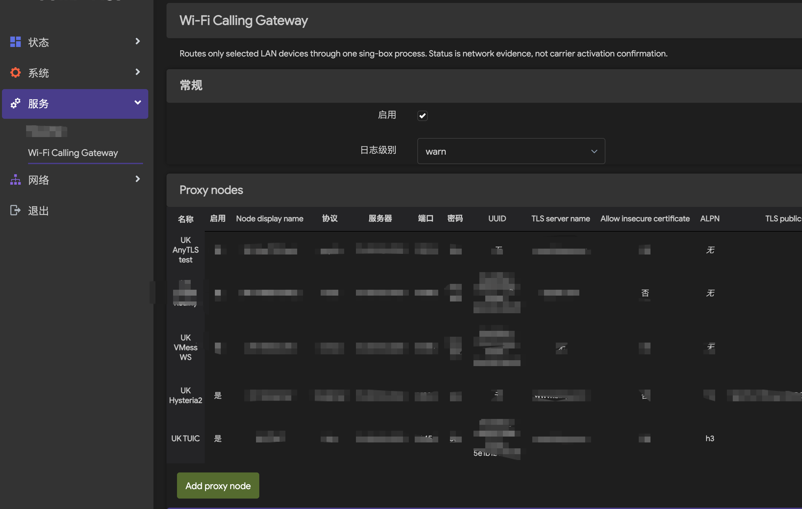
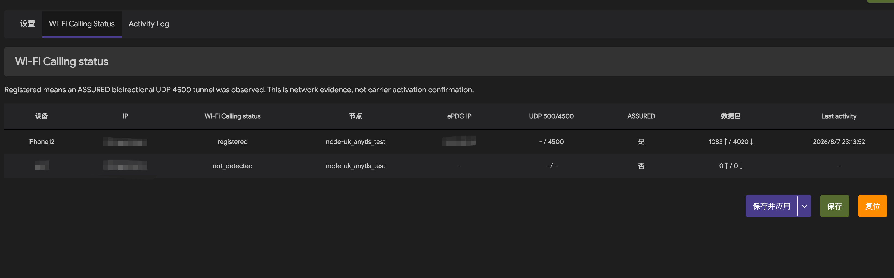
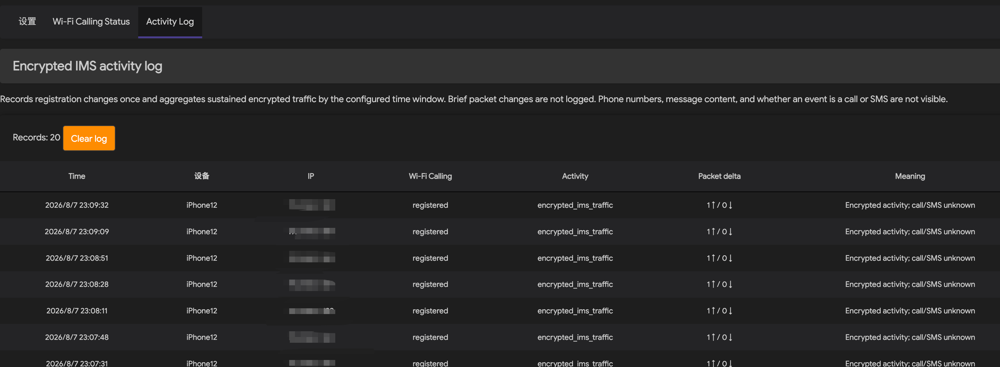
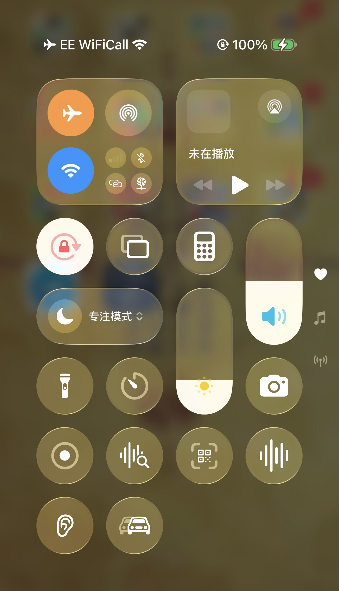

# Wi-Fi Calling Gateway

[中文](README.md) · [Install](docs/en/INSTALL.md) · [Configure](docs/en/CONFIGURATION.md) · [Troubleshoot](docs/en/TROUBLESHOOTING.md) · [Development](DEVELOPER.md)

A standalone LuCI package for OpenWrt and ImmortalWrt. It transparently routes selected LAN clients through selected sing-box outbounds while leaving other clients on the normal gateway routing. It also reports observable ePDG/IPsec UDP 500/4500 evidence commonly associated with Wi-Fi Calling.

### Settings



### Wi-Fi Calling status



### Activity log



### Real-device observation

An actual iPhone showing **EE WiFiCall** in Airplane Mode over Wi-Fi:

<p align="center">
  
</p>

The screenshot proves the handset reached the Wi-Fi Calling registration state; number activation and calling capability must still be confirmed with a real call or by the carrier.

## Features

- **Seven node protocols**: AnyTLS, Hysteria2, TUIC, VLESS Reality, VMess WebSocket, Trojan and WireGuard.
- Paste-import for AnyTLS, Hysteria2/Hy2, TUIC, VLESS, VMess, Trojan (`trojan://`) and WireGuard (`wg://`) share links, plus standard WireGuard `[Interface]/[Peer]` config blocks, with local browser-side parsing; WireGuard preshared keys (PSK) are supported.
- **Real WireGuard handshake health checks**: instead of guessing from ICMP, a temporary sing-box endpoint verifies the tunnel handshake and reports the verified exit IP (60 s cache); failed handshakes carry a reason (missing config / timeout / unreachable) shown as a tooltip in the node table.
- **Per-node instant test**: every node row has a "Test" button — WireGuard nodes re-run a fresh handshake immediately (bypassing the cache), other protocols get a TCP probe, and the result (exit IP or failure reason) is shown as a banner.
- **Automatic DHCP static lease management**: adding/removing a device policy auto-binds/cleans the MAC-IP static lease, tolerating iOS rotating private Wi-Fi addresses (random MACs); the device policy table shows the live binding state (Bound / Not bound yet / MAC changed / Device offline).
- **Add devices from connected LAN devices**: the device policy editor offers a picker of devices seen in DHCP/ARP (hostname preferred, ARP-only entries as fallback; excludes the router and already-bound IPs) and fills the label and IP for you — ARP fallback keeps static-IP and DHCP-less routers reporting online.
- **Service health monitoring**: the Wi-Fi Calling status page shows sing-box/monitor processes, generated-config validity, a **stale-config warning** (UCI changed but the service was not restarted), nftables rule count and a node health summary.
- One selected node per device policy; multiple fixed private IPv4 addresses per policy.
- **Independent tunnel** routes through the plugin node; **Follow gateway** is not intercepted and uses the router default routing.
- One sing-box process, nftables TPROXY, transparent TCP and UDP routing.
- Node ICMP/TCP reachability and latency checks (TCP-based protocols fall back to `tcping` when ICMP is blocked).
- Built-in Simplified Chinese interface (language pack shipped inside the IPK); Chinese descriptions and status, with protocol names and technical fields (TLS, UDP, UUID, SNI, ALPN, Reality, WebSocket, etc.) kept in English.
- Separate LuCI pages for settings, live Wi-Fi Calling status, and encrypted IMS activity.
- UDP 500/4500 evidence with registration state, ePDG, ASSURED, packet totals, and last activity.
- Logs only handshake success/failure and sustained encrypted communication (ringing or calls lasting a few seconds); each device independently keeps 20 records by default, and the activity log can be turned off in Settings.
- `sing-box check` before startup and mode `0600` for credential-bearing files.

## Node protocol selection (important)

> **⚠️ Use TCP-based protocols (AnyTLS / VLESS / VMess / Trojan) for gateway exit nodes.**
>
> - TCP-based tunnels deliver reliable, ordered transport under public-network loss/jitter: IPsec keepalives and RTP voice survive, which is what Wi-Fi Calling needs.
> - **UDP/QUIC-based protocols (Hysteria2, TUIC) are not suitable in practice**: a node's "alive" state only proves ICMP reachability (not a proxy handshake), and UDP-in-UDP breaks calls immediately under jitter; a Hysteria2 node with a dead proxy path once left the routed device with **no internet**.
> - WireGuard is UDP but has built-in keepalive/retransmission and works as an exit (the plugin auto-adapts to the sing-box ≥ 1.11 endpoint form).

## Why DHCP static binding is required

The firewall rules identify devices **by IP address**: the `source_ip` entered in a device policy is written into the nftables `clients4` set, and only traffic matching that IP is TPROXY-forwarded to the sing-box node. **If the device's actual IP differs from the policy, the rules never match and the device traffic bypasses the gateway** — historically the most common "configured but not working" cause.

So the device IP must be fixed, which is what a DHCP static lease (binding the device MAC to the policy IP) provides. Since 1.7.0 the plugin reconciles this binding automatically from the live lease table on every service start:

- Adding a device policy → the policy IP gets bound to the MAC of whichever device currently 1.8.5leases it;
- Removing a policy → its binding is cleaned up;
- When iOS rotates its private Wi-Fi MAC, reconnecting Wi-Fi (or rebooting) lets the plugin re-bind the new MAC automatically — no manual config.

The device policy table's **DHCP binding** column shows the live state: `Bound` / `Not bound yet` / `MAC changed, rebind on reconnect` / `Device offline`.

## Monitoring capability boundary (important)

The ePDG/IPsec tunnel (inside UDP 4500) is **fully encrypted**; the router only sees outer-tunnel packet counts, never the SIP signalling, voice or SMS payload inside. Therefore:

- **Calls can be inferred**: sustained bidirectional encrypted traffic after registration (the RTP signature of ringing or an in-call voice stream, lasting a few seconds) is logged as **"Call in progress (inferred from sustained encrypted traffic)"**;
- **SMS cannot be reliably distinguished**: SMS over IMS is a short burst indistinguishable from keepalives/system pushes, so it is **not logged** and never misreported as SMS;
- **Phone numbers, message content and call direction are never visible**.

The activity log records: handshake success / handshake failure / sustained communication (inferred as a call). This is router-side network evidence, not carrier-side confirmation.

## Device tips

- iOS enables "Private Wi-Fi Address" by default, which rotates the MAC and silently breaks hand-made DHCP bindings. Since 1.7.0 the plugin re-binds the device's current MAC from the live lease table on every service start — **reconnecting Wi-Fi (or rebooting the device) restores the binding automatically**, no manual config needed.
- After adding a device policy, if the device's IP does not match the policy, toggle the device's Wi-Fi to re-request a DHCP lease.

## Supported environments

| Item | Scope |
|---|---|
| Firmware | OpenWrt / ImmortalWrt / iStoreOS (22.03+ / 23.05+ line), nftables + TPROXY; **18.06/Lede has a dedicated package** (see "18.06/Lede package" below) |
| 24.10 line (opkg/IPK) | One IPK for OpenWrt 24.10 / ImmortalWrt 24.10 / iStoreOS 24.10, all tested |
| 25.12 line (apk/APK) | One noarch APK for OpenWrt / ImmortalWrt 25.12, all four architectures tested |
| 25.12 architectures | x86_64 ✅ aarch64 ✅ armv7 ✅ mipsel ✅ (official 25.12.3 rootfs + qemu user-mode) |
| Real router | ImmortalWrt 24.10.6, Redmi AX6S, aarch64_cortex-a53 |
| iStoreOS | **24.10.7 full firmware (QEMU full-system, same version as the reported issue)**: install + service active + LuCI Settings/Status/Activity Log pages verified in Simplified Chinese |
| Container/emulation | Official OpenWrt 24.10.8 / 25.12.3 rootfs; iStoreOS 24.10.5 (Docker), 24.10.7 (full QEMU firmware) |
| sing-box | 1.13.0 or newer recommended; the IPK leaves it unversioned (compatible with older sing-box in some feeds); the 25.12 official feed ships sing-box (1.12.17 auto-installed on armv7/mipsel in tests). WireGuard nodes adapt automatically: endpoint form on sing-box ≥ 1.11, legacy outbound on 1.10.x and older (verified against real 1.10.0 / 1.11.7 / 1.12.0 / 1.13.18 binaries) |
| LuCI | Modern JavaScript views |
| Network | IPv4 LAN policies; DHCP static leases auto-synced from device policies (bind/clean MAC-IP on add/remove, tolerates iOS rotating private MACs) |
| Package arch | IPK `all` (Shell + LuCI resources); APK `noarch` (25.12 apk rejects `all`; official packages are distributed per target arch) |

Dependencies: `luci-base`, `sing-box`, `nftables`, `kmod-nft-tproxy`, `kmod-nft-socket`, `ip-full`. (The plugin configures nftables directly and does not use the firewall4 daemon; the hard `firewall4` dependency in 1.7.1 and earlier was exactly what broke installation on 18.06/Lede feeds and was removed in 1.7.2.)

## Quick install

Download the latest stable release (currently 1.8.5) from [Releases](../../releases), upload it to the router, then install. **One `.ipk` for the whole 24.10 line, one `noarch` `.apk` for the whole 25.12 line (any chip).**

**OpenWrt / ImmortalWrt / iStoreOS 24.10.x (opkg / IPK)** — one package for all, verified on real hardware:

```sh
opkg update
opkg install ./luci-app-wificalling-gateway_1.8.5-1_all.ipk
/etc/init.d/rpcd restart
```

> iStoreOS note: some opkg builds report a misleading "No such file or directory" for `./` relative paths or upload locations. Verify the file was **actually uploaded** and use an absolute path:
>
> ```sh
> opkg install /root/luci-app-wificalling-gateway_1.8.5-1_all.ipk
> ```
>
> If the iStoreOS custom opkg rejects local files with `incompatible with the architectures configured` (verified), use the extract install (verified on the 24.10.7 full firmware):
>
> ```sh
> cd /tmp && tar xzf luci-app-wificalling-gateway_1.8.5-1_all.ipk && tar xzf data.tar.gz -C /
> /etc/init.d/wificalling-gateway enable && /etc/init.d/wificalling-gateway start
> ```

**OpenWrt / ImmortalWrt 25.12.x (apk / APK)** — one noarch package covering x86_64 / aarch64 / armv7 / mipsel, all verified:

```sh
apk update
apk add --allow-untrusted ./luci-app-wificalling-gateway_1.8.5-r1_noarch.apk
/etc/init.d/rpcd restart
```

Then open **Services → Wi-Fi Calling Gateway**. Add and save nodes first, then add device policies. See [Install](docs/en/INSTALL.md) and [Configuration](docs/en/CONFIGURATION.md) for details.

### 18.06/Lede package

18.06 feeds lack `firewall4` and usually also sing-box and the TPROXY kernel modules, so the generic package cannot install there. The **`luci-app-wificalling-gateway_1.8.5-1_18.06_all.ipk`** variant from Release depends only on what the official 18.06 feeds actually ship (`luci-base`, `nftables`, `ip-full`) — verified installing on the official 18.06.9 rootfs:

```sh
opkg update
opkg install ./luci-app-wificalling-gateway_1.8.5-1_18.06_all.ipk
/etc/init.d/wificalling-gateway enable
```

Notes:

- The **LuCI pages** need the 19.07+ JS view architecture, which the legacy 18.06 Lua dispatcher cannot serve, so the variant does not register a menu; configure over UCI from the command line (`uci set wificalling-gateway.main.enabled=1`, etc.).
- **sing-box and the TPROXY kernel modules** (kernel ≥ 4.11) must come from your feed; when missing, the service start fails with a clear reason in `logread -e wificalling-gateway`.

## Important boundaries

> **⚠️ Location requirement (prerequisite for Wi-Fi Calling)**
>
> Carriers require the device location to match the SIM's home country before activating Wi-Fi Calling. This plugin provides a country-appropriate IP through the node, but it does **not** control the device's own location (GPS / cell towers / wloc). The device needs a virtual location set to the SIM's home country, otherwise Wi-Fi Calling will not trigger.
>
> **Workaround**: use [ios-location-spoofer](https://github.com/smthdagg/ios-location-spoofer) together with Shadowrocket to spoof iOS location to the SIM's home country. This is a separate project from this plugin.

This plugin only provides network forwarding and observable evidence; it does not modify device location, carrier accounts, IMS configuration, or emergency-call addresses. `likely_registered` only means a bidirectional `ASSURED` UDP 4500 flow was observed; the Wi-Fi Calling indicator, UDP 500/4500, or high traffic alone do not prove the number is activated or that calls will connect. Follow carrier terms and local laws, and verify calling on a real device.

## Project documentation

- [Install & upgrade](docs/en/INSTALL.md)
- [Node and device configuration](docs/en/CONFIGURATION.md)
- [FAQ & troubleshooting](docs/en/TROUBLESHOOTING.md)
- [Development & maintenance (for contributors / automated handoff)](DEVELOPER.md)
- [Security policy](SECURITY.md) · [Changelog](CHANGELOG.md)

## License

[MIT](LICENSE). Not affiliated with Apple, any carrier, OpenWrt, ImmortalWrt, sing-box, or PassWall.
